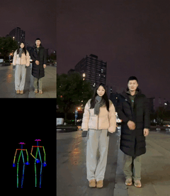
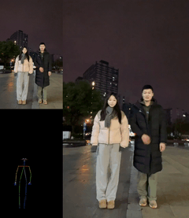
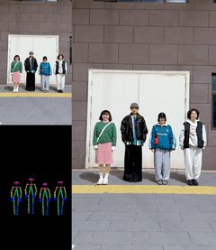
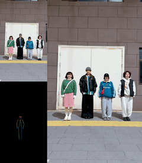

This directory contains example workflows for using SteadyDancer in ComfyUI.

- wanvideo_SteadyDancer_example_03.json: replace the pose detector in [ComfyUI-WanVideoWrapper](https://github.com/kijai/ComfyUI-WanVideoWrapper/blob/main/example_workflows/wanvideo_SteadyDancer_example_01.json) with an **alignment-enabled** one from [ComfyUI-WanAnimatePreprocess](https://github.com/kijai/ComfyUI-WanAnimatePreprocess).
- wanvideo_SteadyDancer_example_04.json: replace the pose detector in [ComfyUI-WanVideoWrapper](https://github.com/kijai/ComfyUI-WanVideoWrapper/blob/main/example_workflows/wanvideo_SteadyDancer_example_01.json) with an **multi-person** one from [comfyui_controlnet_aux](https://github.com/Fannovel16/comfyui_controlnet_aux) to support multi-person video generation.
    - **Without training in a multi-person scenario**, SteadyDancer can directly perform inference in a multi-person scenario using the multi-person pose detector, although the results may not be optimal.
    - We also experimented with using a single-person detector to provide pose conditions in multi-person scenes, and the results were unexpected. Although **only one person was detected per frame**, by constantly changing the detected person, everyone was able to move as closely as possible according to the conditions.
    - The following results are from using `fp8` at a small resolution.

<table class="center">
    <tr>
    <td></td>
    <td></td>
    <td></td>
    <td></td>
    </tr>
</table>


Preparation steps to set up ComfyUI with the required custom nodes and dependencies:

```
# Clone ComfyUI and required custom nodes
git clone https://github.com/comfyanonymous/ComfyUI
cd ComfyUI/custom_nodes
git clone https://github.com/ltdrdata/ComfyUI-Manager.git
git clone https://github.com/kijai/ComfyUI-WanVideoWrapper.git
git clone https://github.com/kijai/ComfyUI-WanAnimatePreprocess.git
git clone https://github.com/Fannovel16/comfyui_controlnet_aux.git
cd ../

# Set up Conda environment and install dependencies
conda create -n comfyui python=3.10 -y
conda activate comfyui && which python
pip3 install torch torchvision  # Pytorch 2.9.1, CUDA 12.8
pip install sageattention==2.2.0 --no-build-isolation -v && python -c "from sageattention import sageattn"
pip install onnx onnxruntime-gpu
pip install -r requirements.txt
cd custom_nodes
pip install -r ComfyUI-Manager/requirements.txt
pip install -r ComfyUI-WanVideoWrapper/requirements.txt
pip install -r ComfyUI-WanAnimatePreprocess/requirements.txt
```